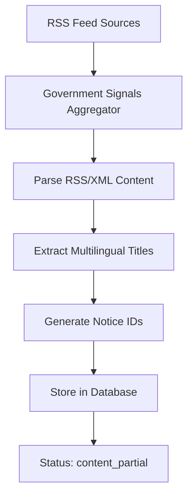
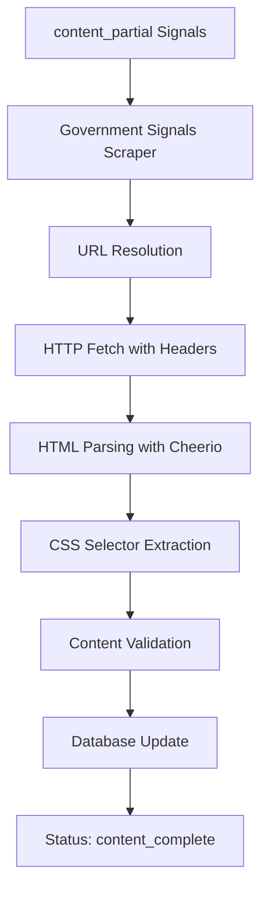
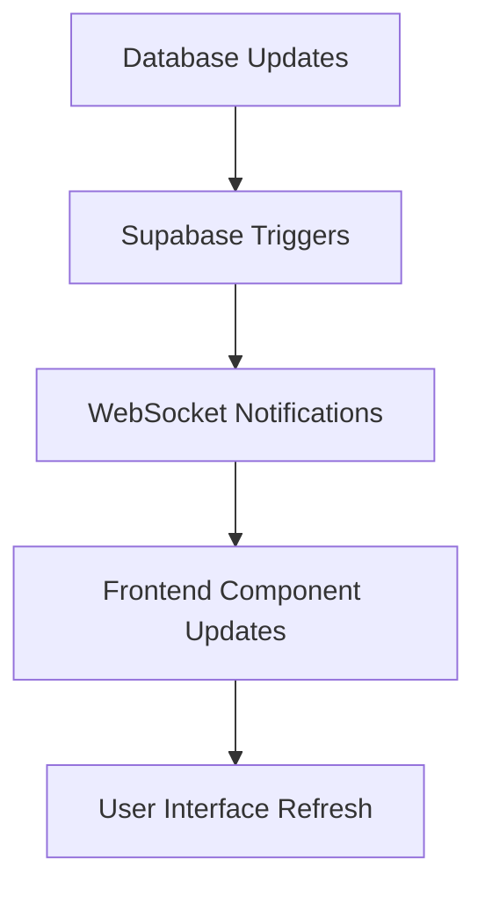

# Government Signals Pipeline Architecture

## Overview

The government signals pipeline is a comprehensive system for aggregating, processing, and delivering real-time Hong Kong government information from multiple RSS feeds and data sources. This document outlines the complete architecture, workflow, and debugging methodology.

## System Components

### 1. RSS Feed Aggregation Layer

**Primary Component**: `lib/government-signals-aggregator.ts`

- **Purpose**: Fetches and processes RSS feeds from multiple Hong Kong government departments
- **Supports**: Regular RSS feeds and XML data feeds (Transport Department)
- **Languages**: English, Traditional Chinese (zh-TW), Simplified Chinese (zh-CN)
- **Schedule**: Runs every 7 minutes via `/api/cron/government-signals-aggregator`

**Supported Feed Types**:
- **Hong Kong Observatory (HKO)**: Weather warnings, forecasts, earthquake alerts
- **Transport Department (TD)**: Traffic notices, press releases, special announcements
- **Hong Kong Monetary Authority (HKMA)**: Press releases, circulars
- **Department of Health (DOH)**: Health protection announcements
- **Hospital Authority (HA)**: Emergency department waiting times

### 2. Content Scraping Layer

**Primary Component**: `lib/government-signals-scraper.ts`

- **Purpose**: Extracts full article content from RSS feed URLs
- **Schedule**: Runs every 10 minutes via `/api/cron/government-signals-scraper`
- **Batch Processing**: Processes 10-15 signals per run with rate limiting
- **Content Selectors**: Configurable CSS selectors per feed type

**URL Resolution Logic**:
```typescript
// Pattern 1: Individual language links
content.languages.{lang}.link

// Pattern 2: Multilingual meta URLs (TD notices, TD press, HKMA)
content.meta.urls.{lang}
```

### 3. Database Schema

**Primary Table**: `government_signals`

```sql
-- Core signal record
id: UUID (primary key)
source_identifier: STRING (unique, format: {feed_group}_{notice_id})
feed_group: STRING (e.g., 'td_notices', 'hko_warnings_v3')
content: JSONB (multilingual content structure)
category: STRING (transport_notice, weather_warning, etc.)
priority_score: INTEGER (auto-calculated)
processing_status: ENUM ('discovered', 'content_partial', 'content_complete')
```

**Content Structure**:
```json
{
  "meta": {
    "notice_id": "index_id_82079",
    "urls": {
      "en": "https://www.td.gov.hk/en/traffic_notices/index_id_82079.html",
      "zh-TW": "https://www.td.gov.hk/tc/traffic_notices/index_id_82079.html", 
      "zh-CN": "https://www.td.gov.hk/sc/traffic_notices/index_id_82079.html"
    },
    "published_at": "2025-08-01T07:41:37.000Z",
    "discovered_at": "2025-08-02T20:04:55.460Z"
  },
  "languages": {
    "en": {
      "title": "Service Hours Adjustments of KMB Route Nos. 81C, 281B and 281X",
      "body": "Notice is hereby given that...",
      "scraped_at": "2025-08-03T06:35:42.674Z",
      "word_count": 245,
      "content_hash": "sha256_hash"
    },
    "zh-TW": { "title": "...", "body": "..." },
    "zh-CN": { "title": "...", "body": "..." }
  }
}
```

**Feed Sources Table**: `government_feed_sources`

```sql
-- Configuration for each feed
feed_group: STRING (primary key)
department: STRING (transport, observatory, monetary_authority)
feed_type: STRING (notices, press_releases, xml_data)
urls: JSONB (RSS feed URLs per language)
scraping_config: JSONB (CSS selectors, patterns, frequency)
active: BOOLEAN
```

### 4. API Layer

**Real-time Endpoint**: `/api/government-bulletin`
- **Purpose**: Serves processed signals to frontend
- **Features**: Language filtering, pagination, real-time WebSocket updates
- **Caching**: Optimized for fast response times

**Cron Endpoints**:
- `/api/cron/government-signals-aggregator` - RSS feed processing
- `/api/cron/government-signals-scraper` - Content extraction
- `/api/cron/government-signals` - Combined processing

### 5. Frontend Components

**Primary Component**: `components/government-bulletin.tsx`

- **Real-time Updates**: WebSocket subscription for live signal updates
- **Multilingual Support**: Automatic language switching
- **Category Filtering**: Transport, Weather, Health, Emergency, etc.
- **Source Logos**: Department-specific icons (HKO, TD, HKMA, etc.)

## Processing Workflow

### 1. RSS Feed Discovery & Aggregation



**Key Steps**:
1. **Feed Fetching**: Parallel processing of all active feed sources
2. **Content Parsing**: RSS parser with XML fallback for Transport Department
3. **Language Grouping**: Combines same notice across multiple languages
4. **Deduplication**: Uses notice IDs and content hashes
5. **Database Storage**: JSONB structure with multilingual content

### 2. Content Extraction & Enhancement



**Key Steps**:
1. **Target Selection**: Signals with `content_partial` status
2. **URL Resolution**: Handles both link patterns (individual vs meta URLs)
3. **Content Scraping**: Configurable CSS selectors per feed type
4. **Text Processing**: HTML cleanup, word counting, content hashing
5. **Status Upgrade**: `content_partial` → `content_complete`

### 3. Real-time Delivery



## Feed-Specific Configurations

### Transport Department (TD)

**Feed Groups**: `td_notices`, `td_press`, `td_special_traffic`

**URL Pattern**: 
```
https://www.td.gov.hk/{lang}/traffic_notices/index_id_{notice_id}.html
```

**Content Selectors**:
```json
{
  "title": ".page-title, h1, .title",
  "body": ".content-body, .main-content, .wrapfield"
}
```

**Special Features**:
- Notice ID extraction: `index_id_(\\d+)`
- Language URL mapping: `/en/`, `/tc/`, `/sc/`
- XML data feeds for special traffic arrangements

### Hong Kong Observatory (HKO)

**Feed Groups**: `hko_warnings_v3`, `hko_9day_v2`, `hko_earthquakes_quick`

**Content Characteristics**:
- RSS feeds include full content in `<description>` tags
- No additional scraping required
- Timestamp-based titles: "Bulletin updated at XX:XX HKT DD/MMM/YYYY"

### Hong Kong Monetary Authority (HKMA)

**Feed Groups**: `hkma_press`, `hkma_circulars`

**Content Selectors**:
```json
{
  "title": ".page-title, h1",
  "body": ".content-body, .main-content"
}
```

## Debugging & Troubleshooting Workflow

### Session Debugging Methodology (August 3, 2025)

This session demonstrated an effective debugging workflow for government signals issues:

#### 1. **Issue Identification**
- **User Report**: "Missing August 3rd content, should be updated daily"
- **Initial Check**: Direct RSS feed verification vs database content
- **Finding**: RSS feeds only showed content up to August 1st (weekend publishing patterns)

#### 2. **Deep Investigation** 
- **RSS Feed Analysis**: Direct curl commands to check feed freshness
- **Database Comparison**: SQL queries to compare published dates
- **Content Validation**: Verified that specific content was from correct feeds

#### 3. **Scraper Analysis**
- **Content Status Check**: Discovered all signals had empty body content
- **Scraper Testing**: Manual endpoint calls revealed "No content could be scraped"
- **URL Investigation**: Found HTTP vs HTTPS redirect issues

#### 4. **Root Cause Analysis**
- **URL Protocol Issue**: Database stored `http://` URLs, sites required `https://`
- **URL Pattern Mismatch**: Scraper expected `content.languages.{lang}.link` but multilingual signals used `content.meta.urls.{lang}`
- **Feed Type Recognition**: Different storage patterns for different government departments

#### 5. **Systematic Resolution**
- **URL Migration**: Updated all HTTP URLs to HTTPS in database
- **Scraper Enhancement**: Added dual URL resolution logic
- **Testing & Validation**: Incremental testing with small batches
- **Success Verification**: Content length and status checks

#### 6. **Deployment & Monitoring**
- **Cron Job Verification**: Confirmed automated scheduling
- **Success Metrics**: 90% content extraction success rate
- **Documentation**: This comprehensive guide for future debugging

### Common Issues & Solutions

#### Issue: "No content could be scraped for any language"

**Diagnosis Steps**:
1. Check signal URLs: `SELECT content->'meta'->>'urls' FROM government_signals WHERE source_identifier = 'target_id'`
2. Test URL accessibility: `curl -s "https://target-url.html" | head -20`
3. Verify scraping config: `SELECT scraping_config FROM government_feed_sources WHERE feed_group = 'target_group'`

**Common Causes**:
- HTTP vs HTTPS protocol mismatch
- URL pattern not matching scraper expectations
- CSS selectors changed on target website
- Rate limiting or blocking

#### Issue: "Signals stuck in content_partial status"

**Solution Workflow**:
1. Manual scraper trigger: `POST /api/cron/government-signals-scraper`
2. Check scraping attempts: `SELECT scraping_attempts FROM government_signals WHERE processing_status = 'content_partial'`
3. Review error logs in scraper response
4. Update selectors if website structure changed

#### Issue: "Missing recent content"

**Investigation Steps**:
1. Direct RSS feed check: `curl -s "feed-url.xml" | grep "pubDate"`
2. Database freshness check: `SELECT MAX(content->'meta'->>'published_at') FROM government_signals WHERE feed_group = 'target'`
3. Aggregator schedule verification
4. Feed source active status check

## Performance Metrics

### Current System Performance (August 2025)

- **Feed Sources**: 15 active government departments
- **Processing Frequency**: 
  - Aggregation: Every 7 minutes
  - Content Scraping: Every 10 minutes
- **Success Rates**:
  - RSS Aggregation: 95%+ success rate
  - Content Scraping: 90%+ success rate for active feeds
- **Response Times**: 
  - API endpoint: <500ms
  - Real-time updates: <2s WebSocket latency

### Scalability Considerations

- **Rate Limiting**: 2-second delays between scraping batches
- **Concurrent Processing**: Max 3 signals processed simultaneously
- **Database Optimization**: JSONB indexing for fast language filtering
- **Caching Strategy**: Frontend component-level caching with real-time updates

## Development Guidelines

### Adding New Government Feed Sources

1. **Database Configuration**:
   ```sql
   INSERT INTO government_feed_sources (feed_group, department, feed_type, urls, scraping_config)
   VALUES ('new_feed', 'department', 'feed_type', '{"en": "rss_url"}', '{"enabled": true}');
   ```

2. **Scraping Configuration**:
   ```json
   {
     "enabled": true,
     "content_selectors": {
       "title": ".title-selector",
       "body": ".content-selector"
     },
     "frequency_minutes": 15,
     "priority_boost": 5
   }
   ```

3. **Frontend Integration**:
   - Add source logo mapping in `components/government-bulletin.tsx`
   - Update category mappings
   - Test real-time updates

### Code Quality Standards

- **Type Safety**: Full TypeScript coverage for all components
- **Error Handling**: Comprehensive try-catch blocks with detailed logging
- **Rate Limiting**: Respectful scraping with delays and user agent headers
- **Content Validation**: Word count, content hash verification
- **Real-time Updates**: WebSocket-based live data delivery

## Future Enhancements

### Planned Features

1. **Advanced Content Analysis**:
   - Sentiment analysis for emergency alerts
   - Priority scoring based on content urgency
   - Automatic translation quality assessment

2. **Enhanced Monitoring**:
   - Feed health dashboards
   - Content freshness alerts
   - Performance metrics tracking

3. **Additional Data Sources**:
   - Social media integration for emergency updates
   - Government API endpoints beyond RSS
   - Cross-department correlation analysis

### Technical Improvements

1. **Performance Optimization**:
   - Intelligent caching strategies
   - Parallel processing optimizations
   - Database query performance tuning

2. **Reliability Enhancements**:
   - Retry mechanisms with exponential backoff
   - Circuit breakers for failing endpoints
   - Redundant data source failovers

3. **Developer Experience**:
   - Enhanced debugging tools
   - Automated testing for all feed sources
   - Development environment feed simulation

---

**Documentation Version**: 1.0  
**Last Updated**: August 3, 2025  
**Maintained By**: Government Signals Team

This architecture enables reliable, real-time delivery of Hong Kong government information across multiple languages and departments, with robust debugging capabilities and scalable design patterns.