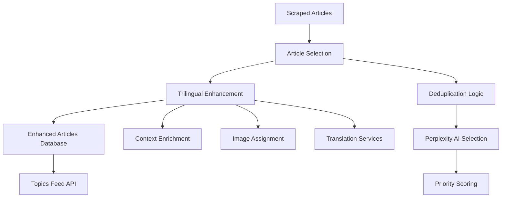

# Article Enhancement Pipeline Architecture

## Overview

The Article Enhancement Pipeline is a sophisticated AI-powered system that automatically selects, enhances, and publishes news articles in three languages (English, Traditional Chinese, Simplified Chinese). The system processes scraped articles through intelligent selection algorithms and creates trilingual enhanced versions optimized for Hong Kong readers.

## System Architecture

### High-Level Flow



## Enhancement Workflows

### 1. Admin Manual Selection + AI Enhancement

**Trigger**: Admin user selects articles from `/admin/articles` interface

**Workflow**:
```
1. Admin selects articles → 2. Mark for enhancement → 3. Trilingual enhancement → 4. Save enhanced versions
```

**Files Involved**:
- `/app/api/admin/articles/mark-for-enhancement/route.ts` - Marks articles for enhancement
- `/app/api/admin/articles/enhance-selected/route.ts` - Processes marked articles
- `/lib/perplexity-trilingual-enhancer.ts` - Core enhancement logic
- `/lib/article-saver.ts` - Saves enhanced articles to database

**Key Properties Set**:
```typescript
// Selection metadata
{
  selected_at: timestamp,
  selection_reason: string,
  priority_score: 80,
  selection_method: 'manual_admin',
  selection_session: sessionId
}

// Enhancement metadata
{
  enhanced_at: timestamp,
  trilingual_versions_created: number,
  batch_id: string,
  enhancement_method: 'admin_trilingual',
  admin_triggered: true,
  source_article_status: 'enhanced_children_created'
}
```

### 2. AI Auto-Select + Enhancement (Admin Triggered)

**Trigger**: Admin presses "AI select and enhance" button

**Workflow**:
```
1. AI selection → 2. Auto-mark for enhancement → 3. Trilingual enhancement → 4. Save enhanced versions
```

**Files Involved**:
- `/app/api/admin/articles/select-article/route.ts` - AI selection endpoint
- `/lib/perplexity-article-selector.ts` - Core selection logic
- Same enhancement files as manual flow

### 3. Automated Cron Pipeline

**Trigger**: Vercel cron jobs (24/7 operation)

**Schedule**:
- **Selection**: `0,15,30,45 * * * *` (every 15 minutes)
- **Enhancement**: `5,20,35,50 * * * *` (5 minutes after selection)

**Workflow**:
```
1. Cron triggers selection → 2. AI selects 1 article → 3. Cron triggers enhancement → 4. Process selected article
```

**Files Involved**:
- `/app/api/cron/select-article/route.ts` - Automated selection
- `/app/api/cron/enhance-selected/route.ts` - Automated enhancement
- `/vercel.json` - Cron configuration

## Core Components

### Article Selection Logic (`/lib/perplexity-article-selector.ts`)

**Selection Criteria**:
- **Time Window**: Last 6 hours (recent news priority)
- **Source Filter**: Only scraped sources (`HKFP`, `SingTao`, `HK01`, `on.cc`, `RTHK`)
- **Status Filter**: `is_ai_enhanced = false` AND `selected_for_enhancement = false`
- **Content Filter**: Minimum 100 characters, valid title
- **Processing Filter**: Exclude articles with `source_article_status = 'enhanced_children_created'`

**Scoring System** (via Perplexity AI):
```
Score = I×4 + N×3 + D×2 + S×1 + U×5 (0-100 points)

I = Impact on HK (How directly affects HK residents/economy/policy)
N = Novelty/Un-dup (How fresh/unique vs recent coverage)  
D = Depth of source (Word count & content richness)
S = Source diversity (Variety across final selection)
U = Under-served topic (Fills gap in recent coverage)

Minimum Score: 70 points
```

### Deduplication Logic

**Multi-Layer Deduplication**:

1. **Title-Based**: Normalized title matching (first 50 chars, lowercase, whitespace normalized)
2. **URL-Based**: Duplicate URL detection and normalization
3. **AI-Powered**: Perplexity AI topic similarity detection
4. **Time-Based**: Avoid articles selected in last 24 hours
5. **Enhanced Topic**: Avoid topics covered in last 7 days

**Implementation**:
```typescript
// Recent title deduplication
const recentTitles = new Set(recentlySelected.map(a => 
  a.title.trim().toLowerCase().replace(/\s+/g, ' ').substring(0, 50)
))

// AI deduplication via Perplexity
const deduplicatedArticles = await filterSimilarTopics(
  candidateArticles, 
  recentlyEnhancedTopics
)
```

### Trilingual Enhancement (`/lib/perplexity-trilingual-enhancer.ts`)

**Enhancement Process**:
1. **Context Enrichment**: Adds Hong Kong-specific context and analysis
2. **Translation**: Creates English, Traditional Chinese, Simplified Chinese versions
3. **Content Structure**: Enhanced titles, summaries, key points, "why it matters"
4. **Image Assignment**: Multi-tier search (Unsplash → Google CSE → Perplexity)
5. **Citation Tracking**: Structured source references

**Output Structure**:
```typescript
{
  title: string,           // Enhanced title
  summary: string,         // AI-generated summary  
  content: string,         // Enhanced content with HTML
  language: 'en'|'zh-TW'|'zh-CN',
  url: `${baseUrl}#enhanced-${language}-${timestamp}`,
  enhancement_metadata: {
    language: string,
    trilingual_batch_id: string,
    enhanced_title: string,
    key_points: string[],
    why_it_matters: string,
    sources: SourceReference[],
    contextual_bullets: string[]
  }
}
```

## Database Architecture

### Articles Table Structure

**Key Fields**:
```sql
-- Core article data
id                    UUID PRIMARY KEY
title                 TEXT NOT NULL
content               TEXT
url                   TEXT UNIQUE NOT NULL
source                TEXT NOT NULL
created_at            TIMESTAMP WITH TIME ZONE
published_at          TIMESTAMP WITH TIME ZONE

-- Enhancement tracking
is_ai_enhanced        BOOLEAN DEFAULT false
original_article_id   UUID REFERENCES articles(id)  -- Links enhanced → source
selected_for_enhancement BOOLEAN DEFAULT false

-- Metadata
enhancement_metadata  JSONB  -- Enhancement details
selection_metadata    JSONB  -- Selection details
trilingual_batch_id   TEXT   -- Groups related language versions
language_variant      VARCHAR(10)  -- 'en', 'zh-TW', 'zh-CN'
```

**Data Relationships**:
```
Source Article (is_ai_enhanced = false)
├── Enhanced English (original_article_id → source, language = 'en')
├── Enhanced Traditional Chinese (original_article_id → source, language = 'zh-TW')  
└── Enhanced Simplified Chinese (original_article_id → source, language = 'zh-CN')
```

### Database Constraints

**Integrity Constraint**:
```sql
ALTER TABLE articles ADD CONSTRAINT check_enhanced_articles_have_source 
CHECK (
  (is_ai_enhanced = false) OR 
  (is_ai_enhanced = true AND original_article_id IS NOT NULL) OR
  (is_ai_enhanced = true AND enhancement_metadata->>'source_article_status' = 'standalone_enhanced')
);
```

## Topics Feed Architecture (`/app/api/topics/route.ts`)

### Query Logic

**Enhanced Articles Only**:
```typescript
let query = supabase
  .from("articles")
  .select("*")
  .eq('is_ai_enhanced', true)
  .is('deleted_at', null)
  .not('original_article_id', 'is', null)  // CRITICAL: Exclude source articles
  .order("created_at", { ascending: false })

// Language filtering
if (language === "en") {
  query = query.eq('enhancement_metadata->>language', 'en')
} else {
  query = query.eq('enhancement_metadata->>language', language)
}
```

**Result**: Shows only enhanced articles (no source duplicates), properly filtered by language.

## Debugging & Maintenance Workflows

### Database Investigation Commands

**Check Enhancement Status**:
```sql
-- Overall enhancement statistics
SELECT 
  is_ai_enhanced,
  COUNT(*) as total,
  COUNT(CASE WHEN original_article_id IS NOT NULL THEN 1 END) as with_source_link,
  COUNT(CASE WHEN enhancement_metadata->>'language' = 'en' THEN 1 END) as english
FROM articles 
WHERE created_at >= NOW() - INTERVAL '7 days'
GROUP BY is_ai_enhanced;
```

**Find Selection Candidates**:
```sql
-- Articles available for selection
SELECT COUNT(*) as candidates
FROM articles
WHERE is_ai_enhanced = false
  AND selected_for_enhancement = false
  AND source IN ('HKFP', 'SingTao', 'HK01', 'on.cc', 'RTHK')
  AND created_at >= NOW() - INTERVAL '6 hours'
  AND content IS NOT NULL
  AND (enhancement_metadata->>'source_article_status') IS NULL;
```

**Check Processing Pipeline**:
```sql
-- Current processing status
SELECT 
  COUNT(CASE WHEN selected_for_enhancement = true AND is_ai_enhanced = false THEN 1 END) as pending_enhancement,
  COUNT(CASE WHEN is_ai_enhanced = true AND original_article_id IS NOT NULL THEN 1 END) as properly_enhanced,
  COUNT(CASE WHEN is_ai_enhanced = true AND original_article_id IS NULL THEN 1 END) as orphaned_enhanced
FROM articles 
WHERE created_at >= NOW() - INTERVAL '24 hours';
```

### Common Issues & Solutions

**Issue 1: Topics Feed Showing Duplicates**
- **Symptom**: Both source and enhanced articles appear in feed
- **Diagnosis**: Enhanced articles missing `original_article_id` references
- **Solution**: Fix relationships and update topics query to exclude source articles

**Issue 2: AI Re-selecting Enhanced Articles**  
- **Symptom**: Already enhanced articles get selected again
- **Diagnosis**: Source articles not properly marked after enhancement
- **Solution**: Ensure atomic transactions in enhancement process

**Issue 3: Cron Jobs Not Running**
- **Symptom**: No recent selections/enhancements
- **Diagnosis**: Check cron schedule in `vercel.json`
- **Solution**: Verify schedule covers current time zone and hours

### Data Cleanup Procedures

**Fix Orphaned Enhanced Articles**:
```sql
-- Link enhanced articles to their source articles
WITH enhanced_with_source AS (
  SELECT 
    e.id as enhanced_id,
    s.id as source_id
  FROM articles e
  INNER JOIN articles s ON (
    SPLIT_PART(e.url, '#enhanced-', 1) = s.url
    AND e.is_ai_enhanced = true 
    AND e.original_article_id IS NULL
    AND e.enhancement_metadata->>'language' IS NOT NULL
    AND s.is_ai_enhanced = false
  )
)
UPDATE articles 
SET original_article_id = enhanced_with_source.source_id
FROM enhanced_with_source 
WHERE articles.id = enhanced_with_source.enhanced_id;
```

## Performance & Monitoring

### Key Metrics

- **Selection Success Rate**: % of cron runs that successfully select articles
- **Enhancement Success Rate**: % of selected articles successfully enhanced
- **Processing Time**: Average time from selection to enhancement completion
- **API Costs**: Perplexity API usage (~$0.075 per enhanced article)
- **Database Growth**: Rate of enhanced article creation

### Health Checks

**API Endpoints**:
- `GET /api/cron/select-article` - Selection statistics
- `GET /api/cron/enhance-selected` - Enhancement statistics  
- `GET /api/topics?language=en` - Feed health check

**Expected Response Times**:
- Topics API: <150ms
- Selection API: <5 seconds
- Enhancement API: <30 seconds (trilingual processing)

## Configuration Files

### Cron Schedule (`/vercel.json`)
```json
{
  "crons": [
    {
      "path": "/api/cron/select-article",
      "schedule": "0,15,30,45 * * * *"
    },
    {
      "path": "/api/cron/enhance-selected", 
      "schedule": "5,20,35,50 * * * *"
    }
  ]
}
```

### Environment Variables
```env
PERPLEXITY_API_KEY=          # AI selection and enhancement
SUPABASE_URL=                # Database connection
SUPABASE_SERVICE_ROLE_KEY=   # Database write access
UNSPLASH_ACCESS_KEY=         # Image search
GOOGLE_API_KEY=              # Fallback image search
CRON_SECRET=                 # Cron job authentication
```

## Future Maintenance

### Regular Tasks

1. **Weekly**: Monitor orphaned enhanced articles and fix relationships
2. **Monthly**: Review API costs and usage patterns
3. **Quarterly**: Analyze selection quality and adjust scoring weights
4. **As Needed**: Update source list when new news sources are added

### Scaling Considerations

- **Volume**: System handles ~96 selections/day (4 per hour × 24 hours)
- **Languages**: Easy to add new languages by updating enhancer
- **Sources**: Add new sources to `scrapedSources` array
- **Selection Frequency**: Adjustable via cron schedule

### Error Recovery

- **Failed Enhancements**: Check logs, retry manually via admin interface
- **Stuck Selections**: Reset `selected_for_enhancement = false` after investigation
- **API Failures**: System includes fallback mechanisms and graceful degradation

---

*Last Updated: July 2025*
*System Status: Production Active (320+ enhanced articles generated)*