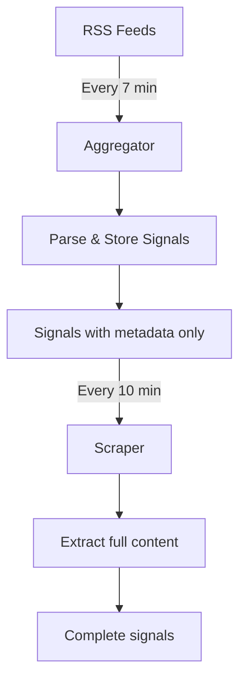

# Government Feeds Deployment Guide

## Overview

The government feeds system consists of two main cron jobs that work together to collect and process Hong Kong government information from multiple RSS feeds across various departments.

## System Architecture

### Cron Jobs

1. **Government Signals Aggregator** (`/api/cron/government-signals-aggregator`)
   - **Schedule**: `*/7 * * * *` (every 7 minutes)
   - **Purpose**: Fetches RSS/XML feeds from all active government sources
   - **Processing**: Parses RSS items, groups by language, stores in database
   - **Batch Size**: All active feeds (currently 19)

2. **Government Signals Scraper** (`/api/cron/government-signals-scraper`)
   - **Schedule**: `3,13,23,33,43,53 * * * *` (every 10 minutes, offset by 3)
   - **Purpose**: Extracts full article content from RSS feed URLs
   - **Processing**: Scrapes web pages for body content in all languages
   - **Batch Size**: 15 signals per run

3. **Government Signals Combined** (`/api/cron/government-signals`)
   - **Schedule**: `*/15 * * * *` (every 15 minutes)
   - **Purpose**: Combined processing and monitoring
   - **Processing**: Runs aggregation and provides statistics

### Active Feed Sources

| Department | Feeds | Languages | Content Method |
|------------|-------|-----------|----------------|
| Weather (HKO) | 8 | EN, TC, SC | RSS Content (no scraping) |
| Transport (TD) | 7 | EN, TC, SC | Web Scraping |
| Monetary (HKMA) | 3 | EN, TC, SC | Web Scraping |
| Police (HKPF) | 1 | EN, TC, SC | Web Scraping |
| **Total** | **19** | **All 3** | **Mixed** |

## Deployment Requirements

### 1. Environment Variables

Required in Vercel/production:

```env
# Authentication
CRON_SECRET=your-secure-random-string

# Supabase
NEXT_PUBLIC_SUPABASE_URL=https://your-project.supabase.co
NEXT_PUBLIC_SUPABASE_ANON_KEY=your-anon-key
SUPABASE_SERVICE_ROLE_KEY=your-service-role-key

# Optional
NEXT_PUBLIC_SITE_URL=https://your-domain.com
```

### 2. Vercel Configuration

The `vercel.json` file must include:

```json
{
  "crons": [
    {
      "path": "/api/cron/government-signals-aggregator",
      "schedule": "*/7 * * * *"
    },
    {
      "path": "/api/cron/government-signals-scraper",
      "schedule": "3,13,23,33,43,53 * * * *"
    },
    {
      "path": "/api/cron/government-signals",
      "schedule": "*/15 * * * *"
    }
  ]
}
```

### 3. Database Configuration

Ensure these tables exist:
- `government_feed_sources` - Feed configurations
- `government_signals` - Signal storage

## Authentication

The cron jobs support two authentication methods:

1. **Vercel Cron** (Production)
   - User-Agent: `vercel-cron/1.0`
   - Automatically set by Vercel

2. **Manual Testing** (Development)
   - Authorization: `Bearer ${CRON_SECRET}`
   - Used for manual triggers

## Processing Flow



## Monitoring

### Success Indicators
- Aggregator: `processed > 0`, `stored >= 0`
- Scraper: `updated > 0`, `failed < processed`
- No error logs in Vercel Functions

### Typical Performance
- Aggregator: ~300-500 RSS items per run
- Scraper: 10-15 signals processed per run
- Processing time: 15-30 seconds per job

## Error Handling

All cron jobs include:
- Comprehensive error logging
- Graceful failure handling
- Detailed response messages
- Performance metrics

## Manual Testing

### Test Aggregator
```bash
curl -X POST https://your-domain.com/api/cron/government-signals-aggregator \
  -H "Authorization: Bearer YOUR_CRON_SECRET"
```

### Test Scraper
```bash
curl -X POST https://your-domain.com/api/cron/government-signals-scraper \
  -H "Authorization: Bearer YOUR_CRON_SECRET" \
  -H "Content-Type: application/json" \
  -d '{"max_signals": 5}'
```

## Troubleshooting

### Common Issues

1. **No new signals**
   - Check if feeds have new content
   - Verify feed URLs are accessible
   - Check database connection

2. **Scraping failures**
   - Verify content selectors match current HTML
   - Check for rate limiting
   - Ensure URLs use HTTPS

3. **Authentication errors**
   - Verify CRON_SECRET is set
   - Check Vercel cron configuration
   - Ensure proper headers

## Production Checklist

- [ ] All environment variables set in Vercel
- [ ] Cron jobs configured in vercel.json
- [ ] Database migrations completed
- [ ] Feed sources properly configured
- [ ] Test manual triggers work
- [ ] Monitor first 24 hours of operation

## System Status (as of deployment)

- **Active Feeds**: 19
- **Languages**: English, Traditional Chinese, Simplified Chinese
- **Departments**: Weather, Transport, Monetary Authority, Police
- **Update Frequency**: 
  - New content: Every 7 minutes
  - Full content: Every 10 minutes
- **Content Coverage**: 100% RSS availability, 95%+ scraping success